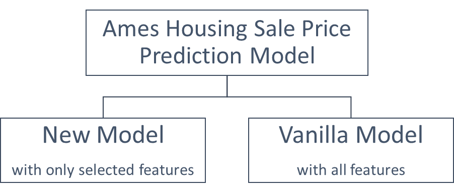
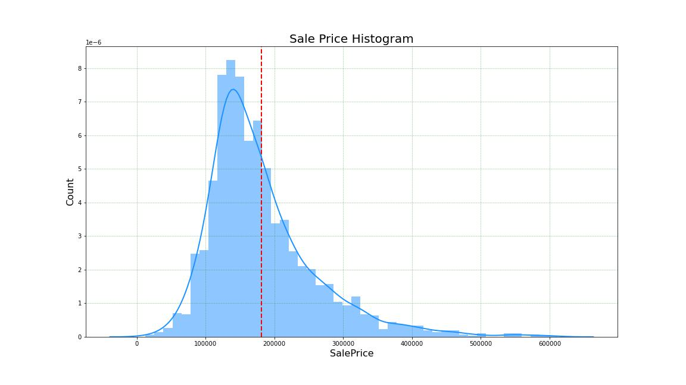
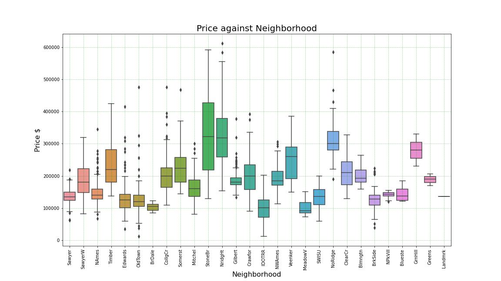
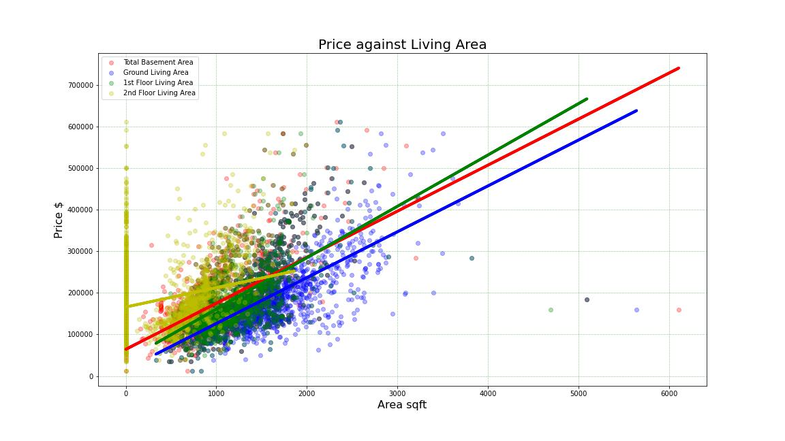
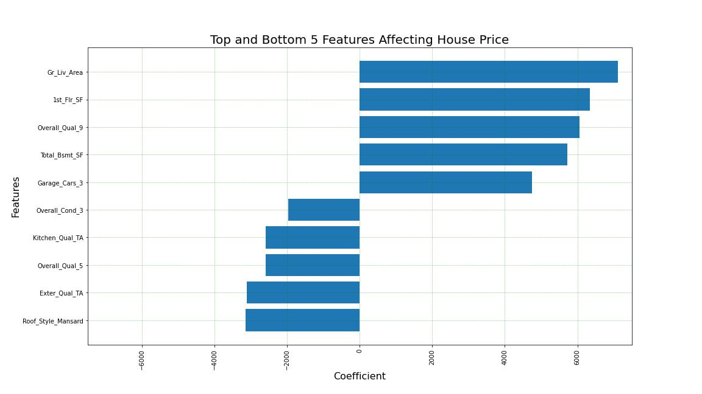

#  Project 2 - Ames Housing Data and Kaggle Challenge

### Overview

With the ever-rising cost of living, essential needs are getting more expensive. Food, clothes, and shelter are unavoidable for everyone. Out of these, shelter or house always contributed to the biggest part of spending. It could easily be one of the largest purchases for some. Money should be spent carefully especially on purchase of this scale. Good thing about houses is the future selling price could be way lower than the current purchase price. If selection of house is made carefully, the house price could appreciate in the future as well. This project is to identify how one could select the house with potential in price appreciation. 

Targeting Ames, Iowa, the sold price for transaction done between the year 2006 to 2010 were recorded. We would be utilizing this dataset to do the modelling and prediction.

### Content

 - [Datasets Sources](#Datasets-Sources)
 - [Problem Statement](#Problem-Statement)
 - [Methodology](#Methodology)
 - [Findings From EDA](#Findings-From-EDA)
 - [Findings From Models](#Findings-From-Models)
 - [Conclusions & Recommendations](#Conclusions-&-Recommendations)
 
### Datasets Sources

This dataset was obtained from Kaggle. The dataset consists of 81 columns and 2051 rows with 78 unique features pertaining to the house condition. The set of data was generated based on the house features and price sold between the year 2006-2010 at Ames, Iowa. 
The features in this dataset are assumed to be not related to one another in this project

 * [`train.csv`](./data/train.csv): Train Ames Housing Dataset ([source](https://www.kaggle.com/competitions/dsi-us-11-project-2-regression-challenge/code))
  * [`test.csv`](./data/test.csv): Test Ames Housing Dataset ([source](https://www.kaggle.com/competitions/dsi-us-11-project-2-regression-challenge/code))
  
The differences between the 2 datasets are the 'SalePrice' columns. The first dataset, Train Ames Housing Dataset contains the transaction price of the ouse while the later dataset does not contain transaction price. Test Ames Housing Dataset is only used to predict the transaction price for submission to Kaggle Challenge.
  
### Problem Statement
  
  For the new home owner, ensuring the house they purchase could yield the highest return in the future, modelling and predictions were made. Hence, the objectives for this project are as follows:
- To identify the top and bottom features that affect the Sale Price of the house
- To identify the non-permanent feature of house that could lead to high Sale Price after renovation.

### Methodology

This project is carried out based on the sequence here. Once the problem statements are identified, this project is carried out in the sequence below:
1. [Data Import](#Data-Import)
2. [Data Cleaning](#Data-Cleaning)
3. [Exploratory Data Analysis](#Exploratory-Data-Analysis)
4. [Modeling Strategy](#Modeling-Strategy)
5. [Conclusion and Recommendation](#Conclusion-and-Recommendation)

#### 1. Data Import
The original data are in the format of .csv files which were imported as Pandas DataFrame format by using Python. Each datasets were then named according to type of examination and year of the data recorded. 

#### 2. Data Cleaning
The original dataset is quite ‘clean’ in the way that not many errors were found despite having over 160,000 cells. Only minor corrections were done on the ‘Year_Built’, ‘Year_Remod/Add’, ‘Garage_Blt_Year’ & ‘Year_Sold’. The errors were detected based on the following conditions:
- ‘Year_Built’ to be earlier than or equal to ‘Year_Remod/Add’
- ‘Year_Sold’ to be later than or equal to ‘Year_Built’, ‘Year_Remod/Add’ & ‘Garage_Blt_Year’

From the data, it was found that approximately 0.5% of the units have their garages built before the house. Where almost half of its were built around the 1920s. Building garage first before the house is a common way for house owner to finance their house construction as they could stay in the garage while waiting for the house to be constructed. ([source](https://getd.libs.uga.edu/pdfs/sager_jonathan_e_200205_mhp.pdf))

#### 3. Exploratory Data Analysis
Apart from identifying the mean, standard deviation, minimum and maximum value, percentile for the continous variables, graphs were developed too to look at the trends.

The histogram of SalePrice was plotted to identify whether the transaction price is following the normal distribution curve or skewed. The relationship between neighborhood and overall quality with sale price were done as well. 

#### 4. Modeling Strategy
Having 80 features which consists of both numerical and categorical data types, we are confident that noises are definitely found in the datasets which will affect the prediction. However, reducing the features with regressions model could also lead to incorrect prediction. Hence, in this project, we set up 2 approaches to do the prediction model and compare the $R^2$ scores.

##### 4.1 New Model
New Model only utilized the best selected features that have high correlation. As the dataset has both continuous and discrete variables, the correlation between continuous variable are made through using the correlation heatmap. The features that have correlation value of over 0.5 are selected.

As for discrete variables, the correlation were identified using Cramer's V Coefficient method. As 2 highly correlated variables can often affect the model prediction, only 1 out of the 2 variables are chosen.

A new dataset is then generated from combining the selected feature from the 2 correlations methods. With this new dataset, New Model is then processed from this dataset.

##### 4.2 Vanilla Model
As for Vanilla Model, the original dataset is loaded into the model without dropping any features apart from the documentation features which are ‘Id’ and ‘PID’ which represent the Transaction ID and Property ID. 

##### 4.3 Regression Techniques
Both New Model and Vanilla Model go through the following regression techniques:
- Linear Regression
- RidgeCV Regression
- LassoCV Regression
- ElasticCV Regression

Apart from Linear Regression, the rest of the are scaled dataset by undergoing the StandardScalar method.
With that, below are the scores for both models and all 4 regression techniques.

#### 5. Conclusion and Recommendation
Scores for both models for all 4 regression techniques were compared and the best one was used to identify the house feature coefficient which has the most and least impacts on Sale Price.

### Findings From EDA
In Ames, Iowa the housing price has mean value of USD 181,469.00

From the chart above, we could see that the house price is positively skewed. Majority of the sale price falls below the mean values. This could be due to outliers’ sale prices that causing the mean value to be higher.

As for the Sale Pricec on Neighborhood, boxplot was done to idenitfy the relationship which can be seen below.

Stone Brook and Northridge Heights have nearly similar median prices. Both neighborhood have the highest mean selling price too. The high number of transactions at Stone Brook in particular could be due the large residential area in Stone Brook.

For Living Area and Sale Price, the relationship between the 4 living areas features with Sale Price are identified with the scatter plot below.

It is predictable that the higher the area, the higher the Sale Price is. We can also conclude that the living areas have linear relationship with the Sale Price. 

### Findings From Models
After doing the regression model, below are the scores for of the modeling.

|Regression Method|New Model Train Score|New Model Test Score|Vanilla Model Train Score|Vanilla Model Test Score|
|---|---|---|---|---|
|Linear Regression|0.921|0.805|0.968|0.735|
|RidgeCV Regression|0.909|0.836|0.947|0.851|
|LassoCV Regression|0.880|0.808|0.932|0.830|
|ElasticCV Regression|0.907|0.839|0.947|0.851|

Based on the techniques, Linear Regression is performing quite well as the train score is highest among all other techniques. However, when it comes to test score, there are differences of over 10% with the train score. This could be due to the model is overfitting and could not perform well in predicting the data.

As for Ridge CV, LassoCV and ElasticNetCV, seems like RidgeCV & ElasticNetCV perform better for both models. Lasso has the advantage of heavily punishing the features and zeroing out the coefficients. This heavy punishment could also be overly doing it causing the model not performing well.

In general, we could see Vanilla Model has higher scores for all techniques. Hence, to proceed further with predicting the features affecting the property price, we will be using the ElasticNetCV Model from Vanilla Model.

From the bar chart above, as a home buyer with intention to yield higher return of investment, it is advisable to choose the house with permanent features from the Top 10 categories while the non-permanent features from the Bottom 5 categories.
In order to yield higher return in the future, the home buyer should aim to renovate or improvise these non-permanent features and convert them to the Top 5 categories. 

From the model, the Top 5 features are:
- Large Ground Living Area
- Large 1st Floor Area
- Overall Quality rated Excellent
- Large Total Basement Area
- Garage Capacity of 3 vehicles

Whereas the Bottom 5 features are:
- Mansard Roof Style 
- External Quality rated Average
- Overall Quality rated Average
- Kitchen Quality rated Average
- Overall Quality rated Fair

### Conclusions & Recommendations
## Conclusions
From the chart above, we would suggest a new home buyer to consider the following when purchasing the house:
Permament Feature:
- Large Ground Living Area
- Large 1st Floor Area
- Large Total Basement Area
- Garage Capacity of 3 vehicles

Non-Permanent Feature:
- Overall Quality rated Average or Fair

As Overall Quality rated Excellent is one of the Top 5 categories, hence it is advisable to home buyer to plan for renovating the house and improve the overall quality to higher rate. This will improve the overall sale prices which in return could provide better investment options.

Based on our analysis, below are the breakdown of the price impact on the top 5 selected features.
|Features|Price Impact (USD)|Unit|
|---|---|---|
|Ground Living Area|15.08|per sqft|
|1st Floor Area|16.80|per sqft|
|Overall Quality rated Excelent|31,254.00|per unit|
|Total Basement Area|13.68|per sqft|
|Garage Capacity of 3 Cars|15,218.67|per unit|

By selecting the features above, the prices are predicted to be increased basing on the price impact. 

As for features to avoid, below are the 5 features that one should avoid:
|Features|Price Impact (USD)|Unit|
|---|---|---|
|Roof Style Mansard|- 55,237.45|per unit|
|External Quality rated Average|- 6,436.48|per unit|
|Overall Quality rated Average|- 5,860.05|per unit|
|Kitchen Quality rated Average|- 5,188.94|per unit|
|Overall Condition rated Fair|- 14,306.46|per unit|
