#  Project 3 - Web APIs & NLP
by Tan Jun Pin

### Overview

We have been engaged by Tekla Investing Inc. for their newly launched product which is Regular Saving Plan on US Exchange Traded Fund (ETF). This new product is  suitable for value investors where they do not expect to have high return in a short period of time which is also a type of long-term investment. Value investors are usually looking at putting aside their money on an investment for a long period of time (approximately 6 months and above) which in return will have smaller risk in losing money.

With the launching of the new investment products by our client, one of the marketing strategies they have is targetted ads based on the posts in www.reddit.com. Targetting correct group of audience with targetted ads is important for better cost control. Our client has shorlisted 2 subreddits which are `r/stocks` and `r/wallstreetbets` for this study. Both subreddits are stock investment related but the nature of the investment are really different in both subreddits. Our client understand that r/stocks is a more suitable subreddit for their new products but there is only 4.6 millions subscribers and 40 posts per days.

They wish to have their ads being seen by more audience where they could have more chances of coverting them to customers. As such, they are exploring if r/wallstreetbets could be the good subreddits for their target ads. r/wallstreetbets has 12.6 millions subscribers and over 300 posts per day which is way more active than r/stocks. However, before spending their resources in this subreddit with almost 3 times more subscribers, they would like to know if r/wallstreetbets is a good fit for this product.

"IAS research found that content with positive and neutral sentiment tends to create greater engagement: 80% of consumers were receptive to these ads, and 93% more were favorable to the ads and associated brands." ([source](https://integralads.com/insider/contextual-advertising-sentiment-analysis/.))

Based on their Marketing Department, apart from targetting the right group of audience, our client wishes to know the period of time where subreddit sentiment is relatively good. They are looking to place their ads on the day or time where sentiments is good as study shows that engagements are generally better during good sentiments. Investments related topics are time-sensitive. The post and topic in the morning may not be relevant anymore in the afternoon. Hence, it is important to know that the nature and sentiments of posts varies from time to time.

---

### Content

 - [Datasets Sources](#Datasets-Sources)
 - [Problem Statement](#Problem-Statement)
 - [Methodology](#Methodology)
 - [Data Cleaning](#Data-Cleaning)
 - [Findings From EDA](#Findings-From-EDA)
 - [Findings From Models](#Findings-From-Models)
 - [Conclusions & Recommendations](#Conclusions-&-Recommendations)
 
---

### Datasets Sources

All datas are scrapped from 2 subreddits which are r/wallstreetbets & r/stocks from www.reddit.com.
Approximately 300,000 posts were scrapped from r/wallstreetbets while approximately 250,000 posts are scrapped from r/stocks.

  
 

### Problem Statement

With the requirements from our clients to promote their newly launched investing product, our objectives for this project are as follows:

- To identify the most common words from r/stocks that are associated with long-term investing and the probability of its appearing in r/wallstreetbets
- To predict the subreddit based on post title and selftext for ads targetting
- To identify the time period where subreddits are having positive sentiments for ads placement.

Using modelling technique such as Naive Bayes method and Random Forest method, the best model basing on F1-score, training and test score will be chosen.
F1-score is more appropriate in this project due to the imbalanced datasets that we have which will be further elaborated later. Both training and test score will be used to judge if a model is over-generalized or under-generalized.

### Methodology

This project is carried out based on the sequence here. Once the problem statements are identified, this project is carried out in the sequence below:
1. [Data Import](#Data-Import)
2. [Data Cleaning](#Data-Cleaning)
3. [Exploratory Data Analysis](#Exploratory-Data-Analysis)
4. [Modeling Strategy](#Modeling-Strategy)
5. [Findings From Models](#Findings-From-Models)
6. [Conclusion & Recommendation](#Conclusion-and-Recommendation)

---

### Data Import
As the posts are purely from `www.reddit.com`, web scrapping method is used to extract the posts and self-text by using pushshift API.

With the limitation in number of posts to be scrapped each time (250 posts per scrap), a for loop method is implemented to continuously scrapping the data. To ensure no datas is missed out, the timestamp of the last scrapped posts from each scrapping will be the starting time for the next scrapping.

Based on the requirements from the client, as investment related topics are time sensitive. Hence, at least 1 year of data is scrapped for both subreddits. Once the data are scrapped, the data are then stored into 2 separate CSV files namely:
* [`wallstreetbet_300k`](./data/wallstreetbet_300k.csv)
* [`stocks_250k`](./data/stocks_250k.csv)

The CSV files are then stored into AWS Bucket manually and for analysis by using `boto3` library

### Data Cleaning
The following data cleaning steps were performed prior EDA and modeling.
* Extracting data from the CSV files starting from 1 September 2021 00:00am to 31 August 2022 23:59am
* Removal of null values
* Removal of Reddit specific text formating by using redditcleaner library
* Removal of [deleted]/[removed] posts & selftext
* Removal of repetitive posts
* Removal of URL links with regex.
* Stemming & Lematizing Texts
* Feature Engineering by combining "post" and "selftext" into a single corpus.

No new imputation was done at this stage as the data is very imbalanced. SMOTE sampling method is used which will be further elaborated in model.

### Exploratory Data Analysis

#### Word Count
Histogram of word counts on the title from both datasets are plotted. In general, r/wallstreetbets has lesser word count comparing with r/stocks. We could see that r/wallstreetbets has larger occurence than r/stocks. This is mainly due to the imbalanced datasets that we have over the period of 1 year. We also identified few outliers where the number of posts is relatively low which we dropped it to prevent skewing the datasets.
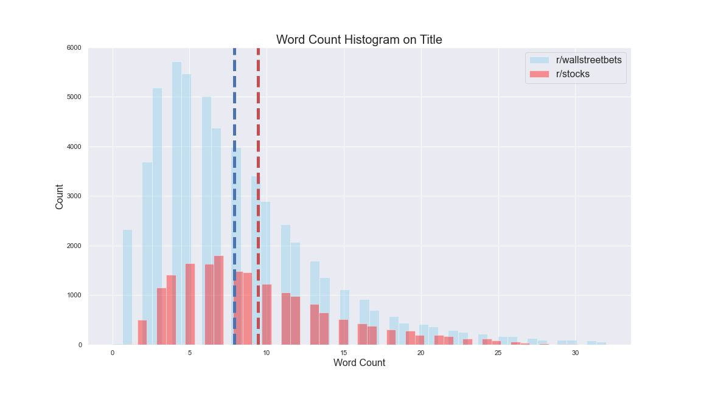

When we are looking at the histogram of the word counts on the title and selftext, several outliers were identified. We could see the data are righly skewed within the range of 0-200. However, we could see that the graphs only ends around 6000 which shows that there are quite some data with over 6000 word counts. For better analysis, outliers with word count over 1000 will be dropped for both datasets.
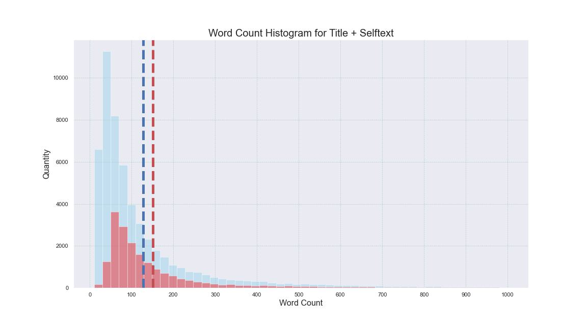

#### Top 10 Common Words

The most appeared words seems to be some normal english language preposition and noun. Hence, stopwords will be used for the analysis.
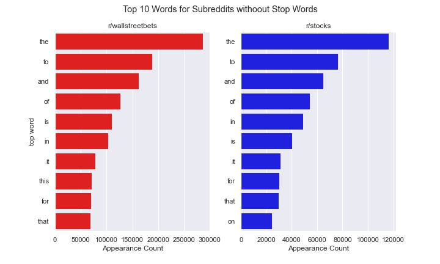

To have better predictions, apart from the common english term that comes with CountVectorizer, additional stopwords related to common financial terms would be introduced.
([source](http://mx.nthu.edu.tw/~chungchichen/papers/NTUSD-Fin_Market_Sentiment_Dictionary_for_Financial_Social_Media_Data.pdf))

Following the most appearing words for both subreddits, we have seen that both subreddits are having quite different most frequently appearing words. For instant, in the original text and lemmatized text, the most frequent appearing words are slightly overlapped (eg: 'rate', 'news', 'post') and the words are illustrated below:
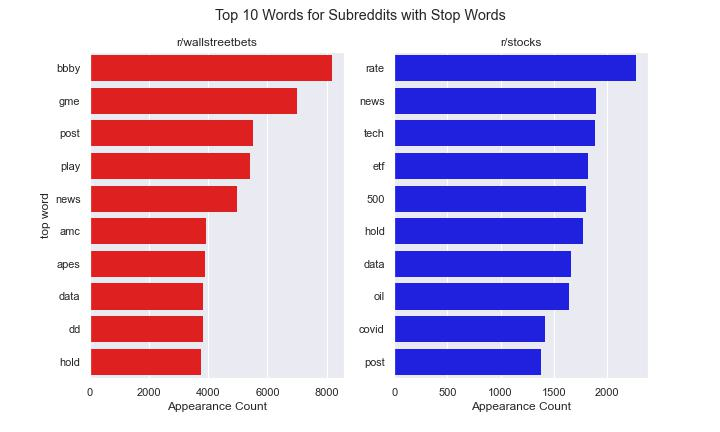
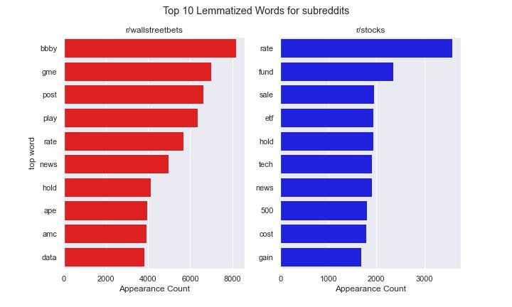

However, for stemmed text, words are 'shortened' and contains mostly spelling mistake. Hence, stemmed texts will no longer be used to proceed for modeling.
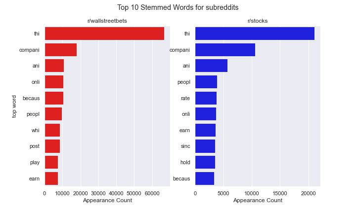

#### Sentiment Analysis
As for sentiment analysis, due to the nature of these subreddits especially r/wallstreetbets, additional words are added to improve the Vadar sentiment analysis. This is due to many common words used in this subreddits are very specific and has different meaning if these words are used in other context. Eg: 'moon', 'tendies', 'stonk' & etc.

With this, we could see that the sentiment in both subreddits are in general positive. This shows a good sign for our clients as positive sendiments in the posts will improved the engagement of their ads. More sentiment analysis related will be done next.
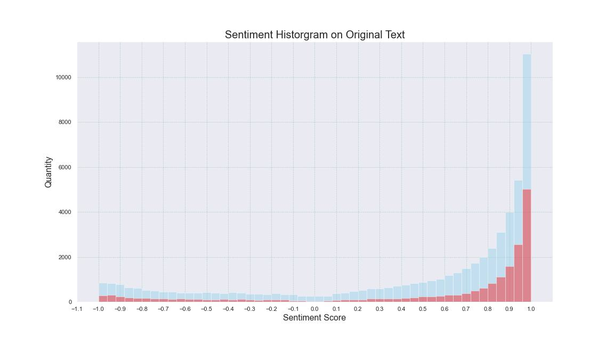

Similar sentiment analysis are also performed on both Stemmed Text and Lemmatized Text. Based on the graphs below, no significant differences are observed.
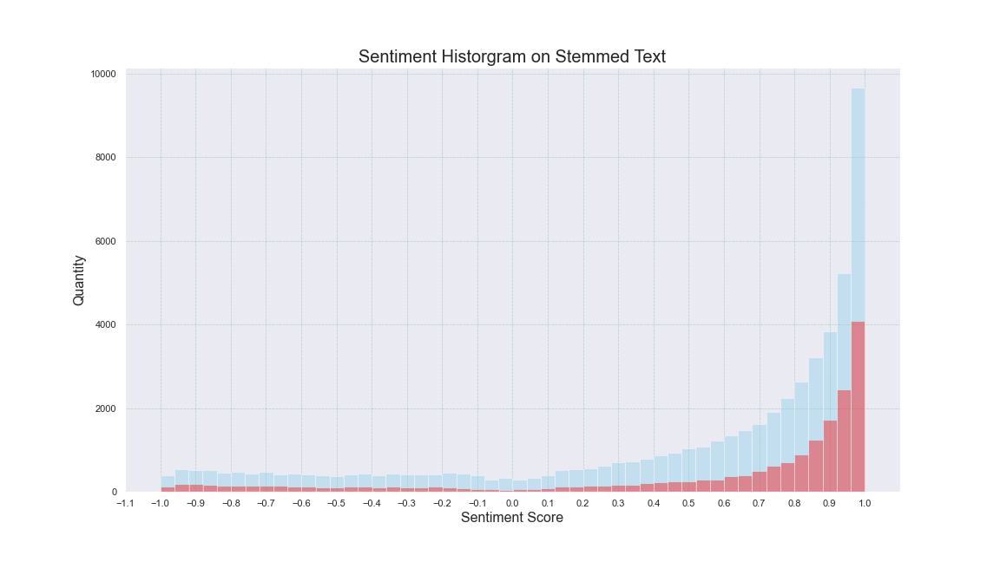
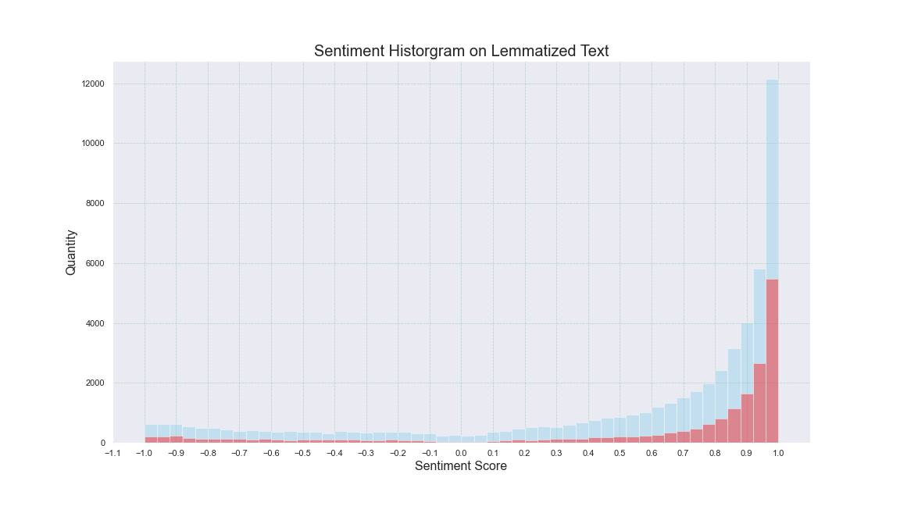

#### Sentiment Analysis Over Time
By grouping the sentiment score based on the hour of day with interval of 30 minutes, we could see that the sentiments is not the same throughout the day. In general, we still see positive sentiment but the peak of the sentiment scores are at evening period of UTC time zone.
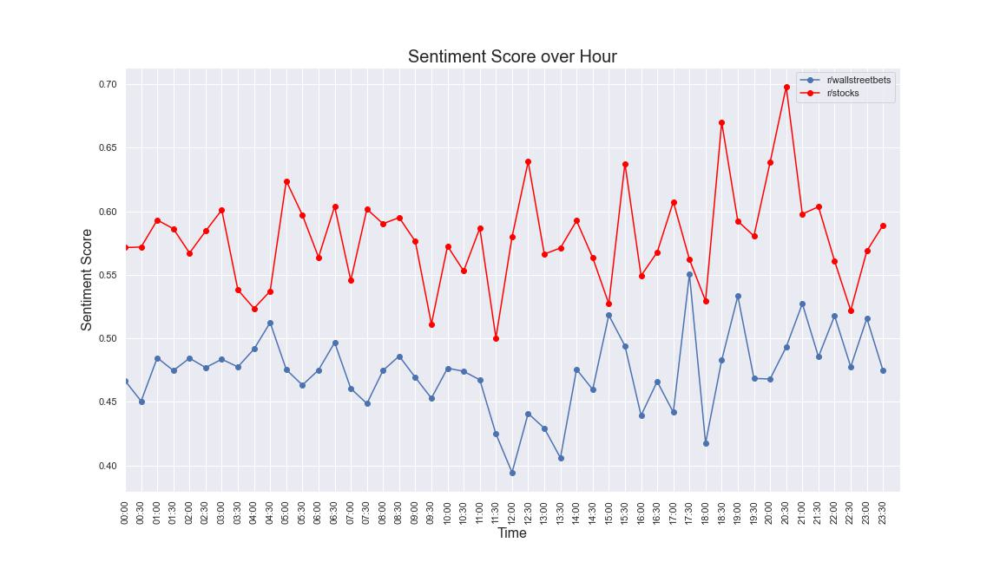

Hence, it is suggested to place target ads to r/stocks between 12:00 to 21:00 and 14:30 to 24:00 for r/wallstreetbets

### Modeling Strategy

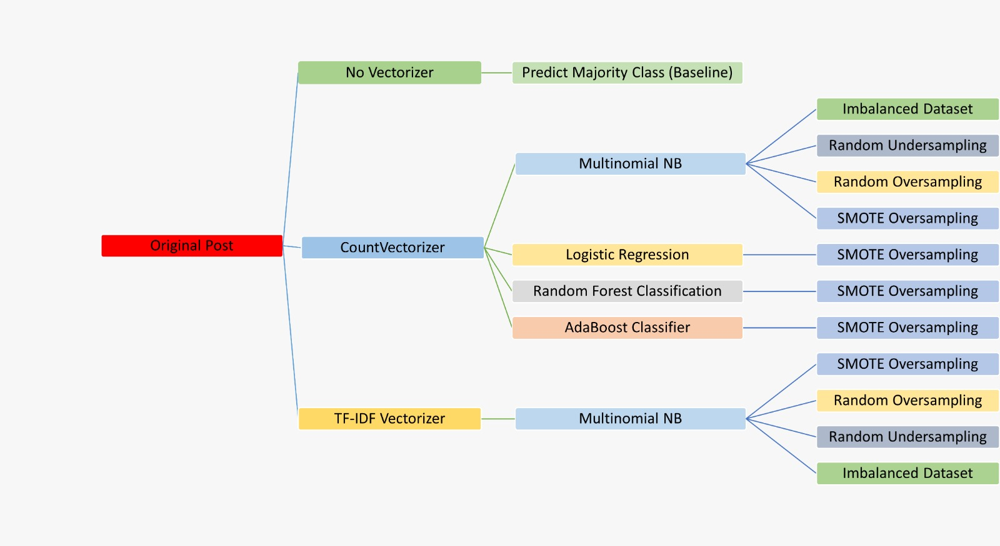
Apart from the baseline model where the classification is done randomly basing on the weightage of the sample in the datasets, in general, we have 2 types of texts for our modeling which are Original Text and Lemmatized Text. For each type of text, we will be applying either Multinomial Naive Bayers method or Random Forest Method for the calssifications using GridsearchCV to identify the best parameters. Lastly, the parameters from the best performing model will then be duplicated but using TF-IDF Vectorizer.

As our datasets are heavily unbalanced, we will also apply SMOTE Oversampling method to balance up the datasets for modeling. A simple illustration of the models done in this project. CountVectorizer is mainly used as the vectorizer method in this project. The best F1-Score model will then be selected but having the TF-IDF vectorizer for both MultinomialNB and Random Forest Classifications method to test out the model performance.

#### SMOTE Oversampling Method
Synthetic Minority Oversampling Technique or SMOTE is a method to duplicate the samples in the minority class synthetically. The samples are generated at random and finds its k nearest minority class neighbors. The synthetic samples are generated as a convex combination of the two chosen instances.

For our case where we have almost 3 times more of r/wallstreetbets data than r/stocks. Hence, SMOTE oversampling method is applied here to compare on the model performances.

#### Model Comparison Metrics
As we are looking at Classification models, due to the imbalanced datasets, F1-Score is used for measurement of success. F1-score are computed based on the Precision and Recall. F1-score is an average of Precision and Recall which means equal weights are given to both Precision and Recall. Accuracy is a the simple classification metric but it does not covers the false negative & false positives which is not the condition we need as we may have unbalanced false negative or positive due to the imbalanced datasets.

Training and Test score of the model will also be used to evaluate the performance of the model. If the model is having a really great F1-score but badly overfit, the model is also not suitable to do the prediction as the prediction may not be accurate.([source](https://towardsdatascience.com/the-f1-score-bec2bbc38aa6))

### Findings From Models
After performing the modeling, below are the scores for each models.

|no  |vectorizer|method             |text_type                                |precision     |recall        |f1_score      |training_score|test_score    |
|:---|:---------|:------------------|:----------------------------------------|:-------------|:-------------|:-------------|:-------------|:-------------|
|0   |-         |Randomly Assigned  |Baseline Model with Original Text        |0.251943|0.253506|0.252722|-|-|
|1   |CVEC      |Multinomial NB     |Original Text                            |0.542081|0.500270|0.520337|0.781533|0.765577|
|2   |CVEC      |Multinomial NB     |Lemmatized Text                          |0.542649|0.502697|0.521910|0.780367|0.76592|
|3   |CVEC      |Random Forest      |Original Text                            |0.476066|0.638350|0.545392|0.835635|0.729522|
|4   |CVEC      |Random Forest      |Lemmatized Text                          |0.483482|0.615696|0.541637|0.840588|0.735143|
|5   |CVEC      |Multinomial NB     |Original Text with SMOTE Oversampling    |0.698779|0.771632|0.733401|0.729884|0.720844|
|6   |CVEC      |Multinomial NB     |Lemmatized Text with SMOTE Oversampling  |0.704472|0.768030|0.734880|0.73132|0.724244|
|7   |CVEC      |Random Forest      |Original Text with SMOTE Oversampling    |0.676985|0.890664|0.769261|0.795333|0.734124|
|8   |CVEC      |Random Forest      |Lemmatized Text with SMOTE Oversampling  |0.678523|0.884292|0.767861|0.79662|0.73394|
|9   |TF-IDF    |Multinomial NB     |Lemmatized Text with SMOTE Oversampling  |0.698892|0.803768|0.747670|0.738052|0.730034|
|10  |TF-IDF    |Random Forest      |Lemmatized Text with SMOTE Oversampling  |0.778069|0.767938|0.772970|0.864712|0.775526|

Basing on F1-score, we could see that every models done here are performing better than the baseline models. This is due to baseline model was predicting the classes randomly basing on the datasets weightage.  Hence, we know that our model is at least performing.

Comparing the models using CountVectorizer, we could see that model with SMOTE Oversampling are having the higher F1-score than the unbalanced datasets. From the 4 models with CountVectorizer and SMOTE Oversampling, we could see that Random Forest Classification is performing better than Multinomial NB method in terms of the F1-score and Training score.

The F1-score for these 4 models are only having less than 4% of differences. In terms of Training Score, Random Forest method definitely has better performance but the test score is is approximately 6% difference from the train score. This shows that the model is slightly overfitted and may not be able to evaluate the future model accurately. However, the train and test score for Naive Bayes method are very near to one another. Based on the scores, the model is not overfitted nor underfitted.

Thus, the parameters from Model 6 (Naive Bayes Classification method with SMOTE Oversampling on Lemmatized Text) is chosen for the modeling using TF-IDF vectorizer. Model 9 and Model 10 are then trained based on TF=IDF vectorizer but on Multinomial NB Classification method and Random Forest Classification Method respectively. As a result, both models with TF-IDF vectorizer do perform better than the CountVectorizer. For better interpretation, `Model 9` (Naive Bayes Classification method with TF-IDF Vectorizer and SMOTE Oversampling on Lemmatized Text) is chosen for interpreration.

Using `Model 9`, the coefficients of the words are then extracted. The top 10 most occuring probability words from r/stocks and r/wallstreetbets are then plotted in the bar chart below.
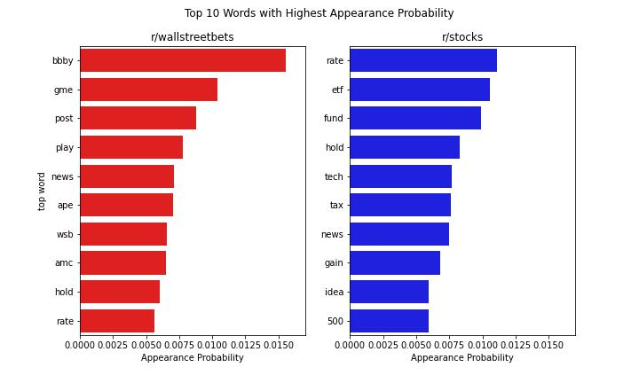

r/stocks comes with word like 'etf' , 'hold', 'fund' and '500' which could be symbolic of long term-investing. 'etf' and 'fund' are strong indicators where the subscribers in r/stocks talk a lot on ETF and funds. These are the highly related to the new product that our client has launched. 
(Note: '500' could be 'S&P 500' which is also a index for long term investment.)

As for r/wallstreetbets, 'bbby' , 'gme', 'ape', 'amc' are the stock tickers of the highly volatile stocks for trading. From these, we could see that r/wallstreetbets are more fond to short term investing where the investors trade on daily basis and expect to gain profit within short period of time which is a high risk investment.

Comparing with the very initial Top 10 most occuring words from the EDA on the Lemmatized Text, the words appeared to be slightly different than our model analysis. However, the indicative words for both r/wallstreetbets and r/stocks are still captured in the top 10 most occuring words. This shows that not all most common words are highly correlated in the prediction.

Trainig and testing on only a single month of data and predict on the other month was done too. 
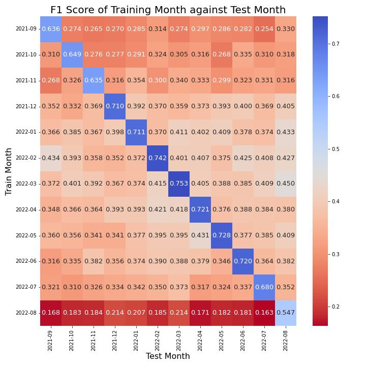

Based on the heatmap above, we could see that in general the model is not performing well unless it is predicting on its own month. This heatmap shows the performance of data from Aug 2022 has the worst performance of all even predicting on its own month. This could be due to the ever changing topic on stocks market whereby the topic has shifted from Aug 2022 onwards.

Comparing with the F1 score we have when using a whole year worth of data to train and test, the performance of this model is definitely not good. Hence, we would not suggest to use only a single month of data for doing the prediction.

### Conclusions And Recommendations
A predictive model with Naive Bayes Classification Method using TF-IDF Vectorizer and SMOTE Oversampling method on Lemmatized Text was developed to do the prediction. The model has the best performance out of the 9 others models developed. The performance of this model is relatively better when we train on 1-year worth of datasets rather than a single month worth of data. Thus, we suggest to train on 1 year worth of data for better prediction.

To accurately target at long-term investors in r/wallstreetbets, it is best to set the target ads to target at subscribers that interacted with posts that have 2 or more r/stocks Top 10 words. This could increase the chances of the subscribers being a long-term investors. The 10 words are:
| | | | | |
|:---:|:---:|:---:|:---:|:---:|
|rate|etf|fund|hold|tech|
|tax|news|gain|idea|500|

We have also identified that the peak sentiment scores period for both subreddits are different. In order to do ads on high sentiment score, it is suggested to place target ads to r/stocks between 12:00 to 21:00 and 14:30 to 24:00 for r/wallstreetbets.

For future works in improving the modelling, the following steps below are suggested:
- To include posts from 3 years ago into the model training as 'Covid-19' had major impact on the stock markets. Covering more years of post will allow the model to perform even during post pandemic period.
- To eliminate all stock tickers and fund names including 'ETF', 'bbby', 'gme' and etc as these could allow the model to pick up word(s) used by the subreddits for better classification instead of relying on these ticker or fund names. These tickers or fund names could be 'outdated' in the future as investing topic is always changing
- To test the model with other classification methods such as AdaBoost Classification & Logistic Regression 
- To use HuggingFace for Sentiment Analysis and evaluate with Vadar Sentiment Analysis
- To deploy the model in StreamLit for better user interface
- To carry out Demojize for better sentiment analysis