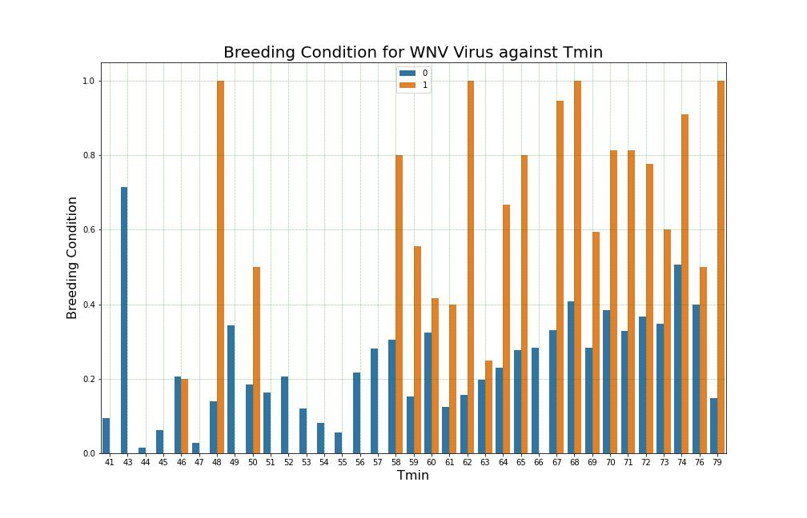

#  Project 4 - West Nile Virus Prediction at Chicago

by Jerome, Yong Quan and Jun Pin

---

## Executive Summary

First, we analyzed the dataset for missing values and also to understand the datatype of the variables. We mainly changed the "Date" columns datatype to datetime format and also to input values for the missing data. We have also conducted exploratory data analysis on our datasets to investigate and examine any underlying trends and to further obtain insights on the data.

---

### Content

 - [Datasets Sources](#Datasets-Sources)
 - [Problem Statement](#Problem-Statement)
 - [Methodology](#Methodology)
 - [Data Cleaning](#Data-Cleaning)
 - [Findings From EDA](#Findings-From-EDA)
 - [Findings From Models](#Findings-From-Models)
 - [Conclusions & Recommendations](#Conclusions-&-Recommendations)
 
---

### Datasets Sources

All datasets were obtained from Kaggle Competition on Predict West Nile Virus 
([source](https://www.kaggle.com/competitions/predict-west-nile-virus/overview))

There are total of 4 datasets were given which are:
* [`train`](./assets/train.csv)
* [`test`](./assets/test.csv)
* [`weather`](./assets/weather.csv)
* [`spray`](./assets/spray.csv)

Train Dataset - There are 12 columns (i.e. Date, Address, Trap, NumMosquitos, WNVPresent, etc.) in the dataset and consists of data from 2007, 2009, 2011 and 2013.  
Test Dataset - There are 11 columns in the dataset and consists of data from 2008, 2010, 2012 and 2014. The columns are similar to the train dataset with the addition of the ‘Id’ column and removal of the ‘NumMosquitos’ and ‘WNVPresent’ columns.  
Spray Dataset - It consists of spraying efforts data in 2011 and 2013 which includes the date, time as well as the latitude and longitude (i.e. location) of the spray.  
Weather Dataset - It consists of weather data from 2007 to 2014 and a total of 22 columns in the dataset. 

### Problem Statement

West Nile Virus (WNV) is the leading cause of mosquito-borne disease in the continental United States. It is most commonly spread to people by the bite of an infected mosquito. There are no vaccines to prevent or medications to treat WNV in people. Based on research ([Link](https://www.cdc.gov/westnile/index.html)), we understand that about 1 out of 150 infected people develop a serious, sometimes fatal, illness. Due to the recent epidemic of West Nile Virus in Chicago, the Department of Public Health has set up a surveillance and control system in which data on the mosquito population has been collected over time. We, as data scientists, have been engaged to analyze the collected data to investigate and predict the presence of WNV. We will also be doing a cost-benefit analysis in relation to the spraying of pesticides to control the spread of WNV.

### Methodology

This project is carried out based on the sequence here. Once the problem statements are identified, this project is carried out in the sequence below:
1. [Data Cleaning and Exploratory Data Analysis](#Data-Cleaning_and_Exploratory_Data_Analysis)
3. [Exploratory Data Analysis](#Exploratory-Data-Analysis)
4. [Feature Engineering](#Feature_Engineering)
5. [Modeling Strategy](#Modeling-Strategy)
6. [Findings From Models](#Findings-From-Models)
7. [Conclusion & Recommendation](#Conclusion-and-Recommendation)

---

### Data Cleaning and Exploratory Data Analysis
We analyzed the dataset for missing values and also to understand the datatype of the variables. There were no null values in both the train and test datasets and we changed the "Date" column datatype to datetime format. For the spray dataset, we changed the “Date” and “Time” columns datatype to datetime format. We also noted that there were 584 rows in which there were “NA” values in the “Time” column. We dropped the “Time” column from the dataset as we will not be using this information for our further analysis. For the weather dataset, we changed the “Date” and “ Time” columns datatype to datetime format. We understand from the documentation provided that there are missing data indicated as “M”, ‘-’ for values not available for sunset/sunrise as well as “T” for trace data. Therefore, we have inputted these values in the weather dataset accordingly. We have also conducted exploratory data analysis on our datasets to investigate and examine any underlying trends and to further obtain insights on the data.

### Feature Engineering

As the datasets is highly unbalaned with ratio of 96%% vs 4% between WNV being not present vs present, to ensure the model can perform well, we would be looking at balancing the datasets.

Approaches to reduce the imbalanced dataset, the followings steps are to be taken;

- Drop rows with mosquitos species with no history of carrying WNV
- Drop rows with lower Tmin, Tmax, Weather Conditions where there was no history of mosquito breeding in that weather

By applying these measures, the datasets should be slightly better in terms of balancing.

#### Remove rows with Mosquito Species with no history of carrying WNV

Based on the barchart above, we could infer that only 3 species of mosquitos carry the WNV. As 6 types of mosquitoes were noted during the survey, we would be dropping away rows that captured the 'Culex Salanarius', 'Culex Territans' & 'Culex Tarsalis' from our data.

#### Remove rows with Tmin, Tmax & Weather Condition with no history of carrying WNV

##### Tmin

As we could see, where Tmin falls below 45 Farenheit, the breeding of WNV carrying mosquitos is null. Hence, these rows will be removed.

##### Tmax

As we could see, where Tmax falls below 61 Farenheit, the breeding of WNV carrying mosquitos is null. Hence, these rows will be removed.

##### Weather Condition

We noticed that some weather conditon does not promote breeding of WNV carrying mosquitos or even suitable for mosquitos to breed on. Hence, we would identify the condtions where the it is not suitable for breeding of WNV mosquitos

### Modeling Strategy

2 sets of model will be trained here in order to predict the present of WNV. 

Model 1 is to predict Breeding Condition in which the features are mainly relying on weather. Hence, 'Trap' and 'Species' will be removed. The ordinal feature will be one-hot encoded.

Model 2 is to predict Present of WNV in which the features are mainly relying on breeding conditon, trap location and species. Hence, weather related features will be removed. The ordinal feature will be one-hot encoded

Apart from the baseline model where the logistic regression is used as the baseline clasification method for both models, we are using other 6 classification methods on both normal sampling and SMOTE oversampling to compare on the performance. 

GridsearchCV is also used here in where the scoring is basing on F1-Score to return the best F1-score.

#### SMOTE Oversampling Method
Synthetic Minority Oversampling Technique or SMOTE is a method to duplicate the samples in the minority class synthetically. The samples are generated at random and finds its k nearest minority class neighbors. The synthetic samples are generated as a convex combination of the two chosen instances.

#### Model Comparison Metrics
As we are looking at Classification models, due to the imbalanced datasets, F1-Score is used for measurement of success. F1-score are computed based on the Precision and Recall. F1-score is an average of Precision and Recall which means equal weights are given to both Precision and Recall. Accuracy is a the simple classification metric but it does not covers the false negative & false positives which is not the condition we need as we may have unbalanced false negative or positive due to the imbalanced datasets.

Training and Test score of the model will also be used to evaluate the performance of the model. If the model is having a really great F1-score but badly overfit, the model is also not suitable to do the prediction as the prediction may not be accurate.([source](https://towardsdatascience.com/the-f1-score-bec2bbc38aa6))

### Findings From Models
After performing the modeling, below are the scores for each models.

#### Model 1 - Prediction of Mosquito Breeding Condition

Based on the summary score above, we would use the metric of F1-Score to measure the performance of our models. We could see that the F1-score for Adaboost Model performs the best on both original cleaned dataset and SMOTE oversampling methods.

To acertain on the F1-score, GridSearchCV was also done on both sampling methods. From the result, we could see that the SMOTE oversampling methods indeed performed better than normal sampling. The scores are around the range of 0.65. Out of the models, we have narrowed down to Bagging Classifier with SMOTE sampling and Bagging Classider with SMOTE & GridSearch CV. Both scores are really close but the train and test score for the Bagging Classifier with SMOTE is slightly higher.

Hence, Bagging Calssification will be used to predict the Breeding Condition on both train and test datasets for Model 2 deployment.

#### Model 2 - Prediction of Present of West Nile Virus

Based on the model performance above, we would be looking at F1-score again due to very unbalanced datasets of 96% vs 4%. Despite performing the feature selection and engineering on removing the features that are not related to cultivating WNV, we still see a badly performed F1-Score on the initial datasets. This shows that the models did not accurately predict the wanted class which is the present of WNV.

With some models has F1-score similar to Base Model, those models will not be considered to going further.

At here, we decided to select the models with SMOTE Oversampling with GridSearchCV. We noticed that the F1-scores for Bagging Classifier, Random Forest Classifier, AdaBoost Classifier and Support Vector Classifier are really closed to one another which is 0.80. To further select down to only 1 model, we look at the Train and Test Score of the 4 models. Basing on the Train and Test Score, it seems that Decision Tree Classifier had a better train and test score which shows that the model is able to predict well. Despite the model is slightly overfit, but the scores is quite negligible.

Thus, Bagging Classifier would be used to do the prediction

#### Feature Importances

In model 1 where prediciton of Breeding Condition of Mosquito, we could see `DewPoint`, `Tmin`, `Tmax`, `PrecipTotal`, `Cool`, `Tavg` & `WetBulb` are the importance features we see in Model 1. We could imply that these weather parameters are highly related in contributing for breeding mosquitos.

As for Model 2, seems like Breeding Condition is the main reason why WNV present. Traps are also shown in the Top 10 features but the scores are relatively lower compared with Breeding Condition. We could see top 9 traps that have higher importance in having WNV. These could be the target for spray.

From these 2 models, we could conclude that weather is an importance factors in contributing WNV. We are see some 9 traps stated here and these could be the locations with higher WNV. These could be the focus spray locations if required. 

## Results
### Map of Chicago overlayed with the predicted cases

### Analysis
1. The North area of Chicago is predicted to have high presence of WNV infected mosquitoes 
2. Possible missing spray spots such as South-East part of Chicago
3. Even with high concentration of spraying in the upper region of Chicago, it does not seem that the present of such WNV infected mosquitoes are predicted to deteriorate. Therefore we would look into the frequency of spray and possibly make a recommendation to increase it if neccessary if the benefits outweighs the cost

#### Further search into the frequency of the sprays

We can observe that frequency has a wide range of values and we could see potential improvements in the WNV infected mosquitoes if we reduce the interval between each spray.

## Cost Benefit Analysis
### Cost of Spray
The total land size of Chicago is at 607.4 km2 which is roughly 150,000 Acres. [(*source*)](https://www.ncbi.nlm.nih.gov/pmc/articles/PMC3945683/) Since the traps in the dataset does not cover the entire land of Chicago, we would assume spraying the whole of Chicago to make sure that mosquitoes are exterminated.

The spray that is used is known as **Zenivex**, which has been approved by the Environmental Protection Agency in ths US. [(*source*)](https://news.wttw.com/2021/08/23/north-side-targeted-mosquito-spraying-risk-west-nile-virus-now-high)

The cost of using Zenivex is at 67¢ per acre to be at, therefore the total cost of spraying the $0.67 * 150,000 = $100,500.

When we consider the half life of the Zenivex spray to be at 1.5 days, [(*source*)](https://vector.sccgov.org/sites/g/files/exjcpb676/files/Zenivex%20FAQs%20June%202020.pdf) and the breeding cycle of a mosquito takes approximately 8-10 days, we would have to spray twice month to get effective results. The total cost of the sprays would be at **US$2.42 million**.

### Medical and Indirect Cost
|Severity of Symptom|Medical Cost (USD)|Description|
|---|---|---|
|Moderate|4,467|Non-neuroinvasive disease|
|Severe|20,774|Acute Flaccid Paralysis (AFP) and speech impediment|

Additional medical cost can include follow-up visits, medication and home modifications in the case of severe neuroinvasive disease comes to an estimated additional cost of US$783

The medical cost spent on WNV based on 225 reported cases and 22 fatalities: US$1.64 million

The indirect cost of WNV can include such as lost of productivity which can be extrapolated by using the average income per day in Chicago which is US$200. [(*source*)](https://www.salary.com/research/company/hourly-wage-for-chicago-il).

According to a study done on the economic cost of WNV, the average patient misses 50 work days. [(*source*)](https://www.ncbi.nlm.nih.gov/pmc/articles/PMC3323281/) For the fatality cases, the lifetime productivity cost is approximately US$1.2 million. [(*source*)](https://www.ncbi.nlm.nih.gov/pmc/articles/PMC6688510/)

Therefore, **Total Productivity Lost** = 50 * US$200 * 225 + 22 * US$1.2 million = US$28.7 million

Total cost of WNV infections = **US$30.3 million**
## Conclusion
1. The model we selected for both predicting the breeding conditions and predicting the presence of WNV is the bagging classifier with the highest F1 score
2. With our model, we came to the conclusion that the benefits of spraying the whole of Chicago far outweighs the cost of it
3. Spraying can only deter the WNV infected mosquitoes to a certain extent. Having good practices on preventing stagnant water will aid towards breeding mosquitoes in general.
